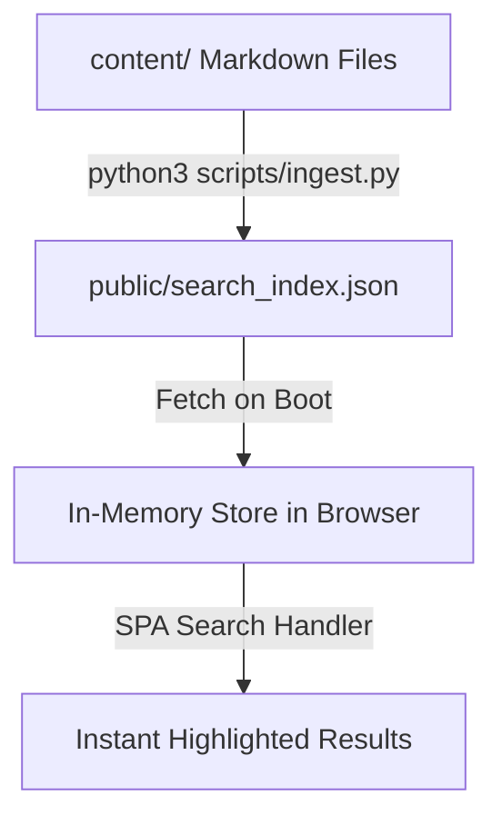

# Agent Operations Manual: Cenz.Blog 🤖🚀

Welcome, Agent! This repository is a state-of-the-art developer blog called **Cenz.Blog**. It is engineered as an ultra-fast, premium developer blog hosted on GitHub Pages, featuring an immersive space-dark style and a client-side search engine.

This manual documents the architecture, database pipelines, frontend rendering logic, and development standards to help you maintain, expand, or debug this project efficiently.

---

## 🏗️ Repository Architecture & Design System

The blog operates entirely as a serverless static site. To avoid external search APIs or heavy runtime databases that conflict with the static-only environment of GitHub Pages, this codebase utilizes a high-performance **client-side in-memory JSON search index**.

### Data & Compilation Flow


### Key Components

*   **Content Store**: [content](file:///Users/cenz.wong/Project/blog/content)
    Raw blog posts written in Markdown with simple YAML frontmatter.
*   **Compilation Pipeline**: [ingest.py](file:///Users/cenz.wong/Project/blog/scripts/ingest.py)
    A Python builder script that processes the frontmatter metadata, structures post content, and generates the consolidated search database.
*   **Design System & UI**: [index.css](file:///Users/cenz.wong/Project/blog/src/index.css)
    A premium space-dark aesthetic utilizing harmonic neon colors (`hsl`), glowing ambient backdrops, subtle card borders, responsive layouts, and rich micro-interactions.
*   **Client Router & Engine**: [main.js](file:///Users/cenz.wong/Project/blog/src/main.js)
    A single-page application (SPA) router handling hash routing (`#/`, `#/search`, `#/about`, `#/post/:slug`), marked-based Markdown parsing, KaTeX math typesetting, and custom keyword-relevance weighted search matching.
*   **Automated Deployments**: [deploy.yml](file:///Users/cenz.wong/Project/blog/.github/workflows/deploy.yml)
    GitHub Actions pipeline that compiles the content index and publishes the production static assets to GitHub Pages.

---

## ⚡ Developer Commands

To run commands, use the workspace directory `/Users/cenz.wong/Project/blog` as the working directory.

| Command | Action | Frequency / When to Run |
| :--- | :--- | :--- |
| `npm install` | Installs pure JS dependencies (Vite, marked) | Setup phase or package changes. |
| `npm run ingest` | Runs the Python ingestion script | Every time content is added, edited, or deleted. |
| `npm run dev` | Boots local Vite dev server on `http://localhost:5173/` | During styling changes or live article drafting. |
| `npm run build` | Regenerates JSON index and runs Vite compilation | Before production check or manual deployment. |
| `npm run preview` | Previews the compiled bundle locally | Verifying production build integrity. |

---

## ✍️ Content Creation Guidelines

All articles are saved in [content](file:///Users/cenz.wong/Project/blog/content). Drafts or hidden posts reside in [content.hiden](file:///Users/cenz.wong/Project/blog/content.hiden).

### Frontmatter Schema
Each post must start with a YAML-like header. The ingestion parser parses this header line-by-line using regular expressions:

```markdown
---
title: "Your Premium Article Title"
description: "A highly descriptive, engaging subtitle or short description."
date: "YYYY-MM-DD"
tags: "Spark, Big-O, Python, WebAssembly"
slug: "your-article-slug"
---
```

> [!IMPORTANT]
> The publication date (`date` field) determines the chronological order of the blog feed. Ensure dates use the `YYYY-MM-DD` format. If a tag is omitted, it will default to `Tech` inside the frontend cards.

---

## 🛠️ Ingestion & Database Compiler Specs

The build-time pipeline is located at [ingest.py](file:///Users/cenz.wong/Project/blog/scripts/ingest.py). 

- **File Types**: Scans for `.md`, `.html`, and `.htm` within [content](file:///Users/cenz.wong/Project/blog/content).
- **Frontmatter Extraction**: Uses regex pattern `FRONTMATTER_RE = re.compile(r'^(?:---|<!--)\s*\n(.*?)\n(?:---|-->)\s*\n(.*)', re.DOTALL)` to safely capture both standard frontmatter and commented formats.
- **Cleanup Routine**: Automatically checks for and deletes any deprecated `public/search_index.db` SQLite files to keep the workspace clean and lean.
- **Compilation Output**: Aggregates metadata along with full post content and saves it sorted in descending date order to `public/search_index.json`.

> [!WARNING]
> Remember that the database is strictly a client-side memory dump. If you modify any markdown files, you **MUST** run `npm run ingest` to build the new JSON index, otherwise your changes will not show up in the web app.

---

## 🎨 Frontend & Search Engine Rules

### 1. Style Guide (Vanilla CSS Philosophy)
- Do not install utility-based CSS frameworks (e.g. Tailwind) or external library styles unless explicitly requested by the user.
- Keep all global variables, dark-mode gradients, animation definitions, and media-queries organized within [index.css](file:///Users/cenz.wong/Project/blog/src/index.css).
- Standard styles include:
  - Custom neon glassmorphism borders (`border: 1px solid rgba(255, 255, 255, 0.08)`).
  - Background space glows (`background: radial-gradient(...)`).
  - Fluid micro-interactions (e.g., custom transform scaling and ease-in-out transitions on hover).

### 2. Search Mechanics & Relevancy Engine
The browser index query engine in [main.js](file:///Users/cenz.wong/Project/blog/src/main.js) uses direct client-side scan scoring:
- **AND Logic**: Results must match **all** keywords entered by the user.
- **Scoring Weights**:
  - Title matches prefix: `+150` pts
  - Title contains keyword: `+100` pts
  - Title contains exact full query phrase: `+300` pts
  - Description matches: `+30` pts
  - Tag matches: `+20` pts
  - Main body match frequency: `+5` pts per keyword instance
- **Highlights & Snippets**: Extracts a dynamic context window (approx. 160 characters) surrounding the first matched search term, sanitizes markdown, and wraps search keywords in standard bold `<b>` highlights.

### 3. Rendering Pipeline
- **Markdown Parsing**: Renders body markup via `marked` client-side.
- **Math/KaTeX**: Supports inline equations (`$ ... $`) and block equations (`$$ ... $$`). The script automatically maps common math tags (like `\times`, `\frac`, etc.) to clean unicode fallbacks if KaTeX fails to load.
- **Syntax Highlighting**: Precode structures are decorated dynamically using Highlight.js (`window.hljs`).

---

## 📜 Checklist for Future Agent Task Execution

When you receive a development goal or a task in this workspace, make sure to:

- [ ] Check if the task involves writing content (Markdown) or code (HTML/JS/CSS).
- [ ] If writing content, place the markdown file in [content](file:///Users/cenz.wong/Project/blog/content) and verify frontmatter has a unique slug and clean date.
- [ ] Run `npm run ingest` to build the compiled `public/search_index.json`.
- [ ] Run `npm run build` to build Vite client distribution files and verify no compile-time warnings/errors.
- [ ] Use `npm run preview` or a dev server instance to manually inspect and verify styling and responsiveness.
- [ ] Avoid editing file extensions to `.ipynb` or introducing unwanted heavy dependencies.
